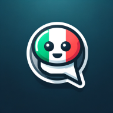

## About

    

<b>MyItalianPal</b>

A chat-based web application designed to assist users in learning Italian language and culture. Powered by OpenAI's API, the application offers an interactive experience where you can engage with an AI assistant designed to emulate an Italian friend eager to teach you Italian language, provide learning exercises, and offer insights into Italian culture.

### Features
- Chat with an AI assistant designed to simulate an Italian friend, receiving Italian language learning exercises and cultural insights
- Set notification preferences to receive daily Italian lessons via chat messages
- Progressive Web App (PWA) functionality for seamless mobile integration
- Push notifications for both PC and mobile devices

## Usage
1. Navigate to the [website](https://myitalianpal.vercel.app/).
2. Sign up with your email.
3. Allow notifications, and ensure they are enabled in your browser or device settings.
4. Set notification preferences in the settings tab to receive daily lessons.
5. Engage with the AI assistant by typing in the chat textbox.

Enjoy learning Italian language and culture interactively!

## Roadmap
- [ ] Enhance AI assistant's conversational capabilities
- [ ] Implement additional language learning features
- [ ] Expand cultural insights and resources